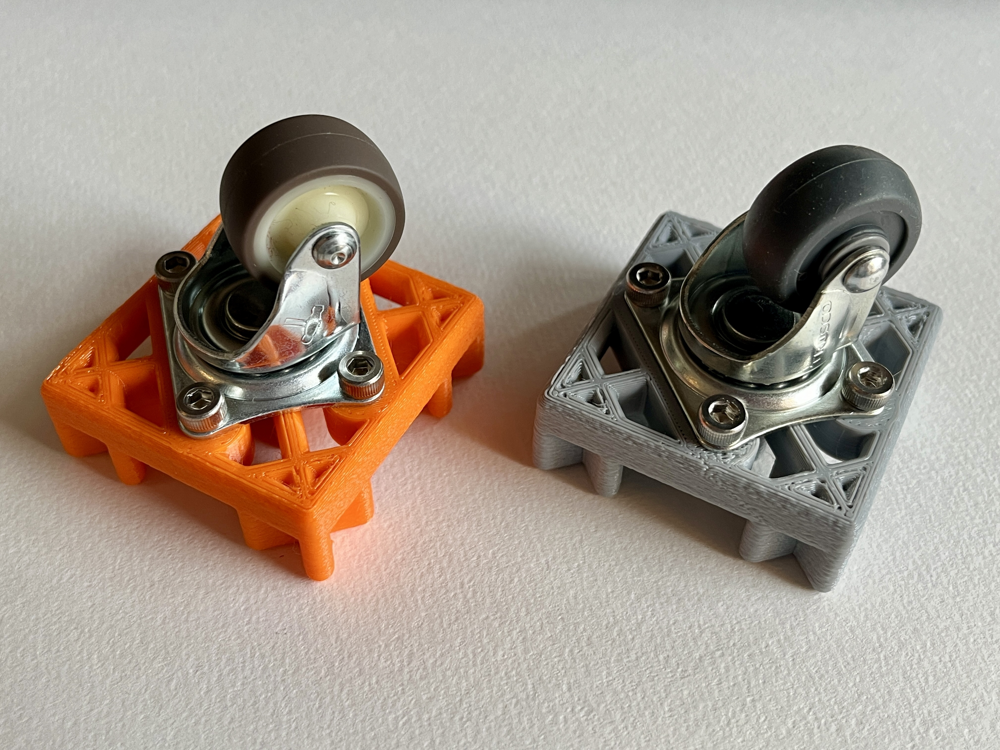
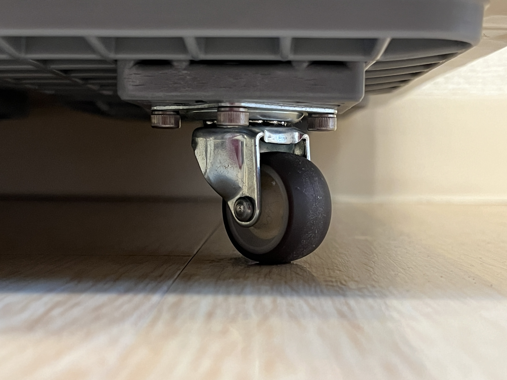
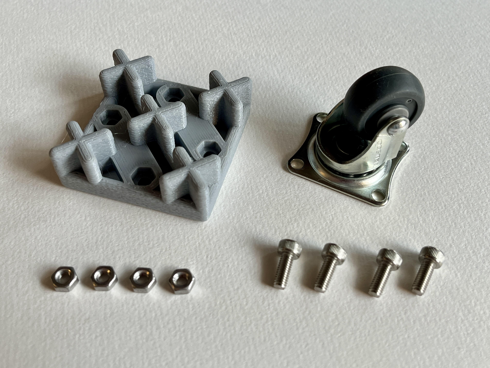
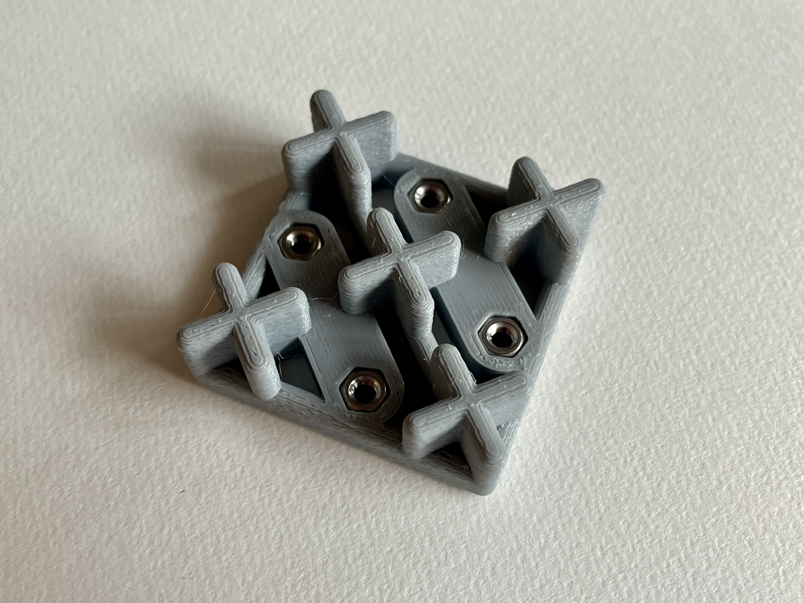
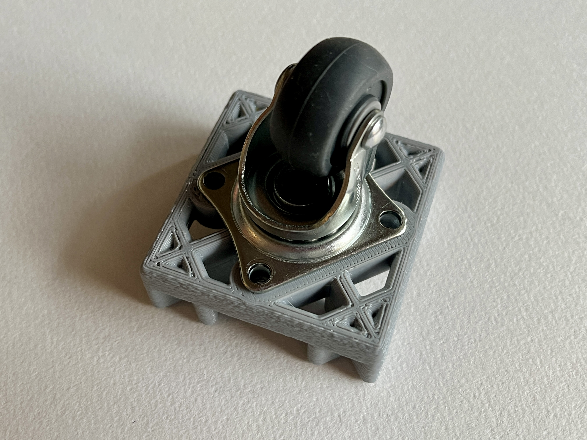
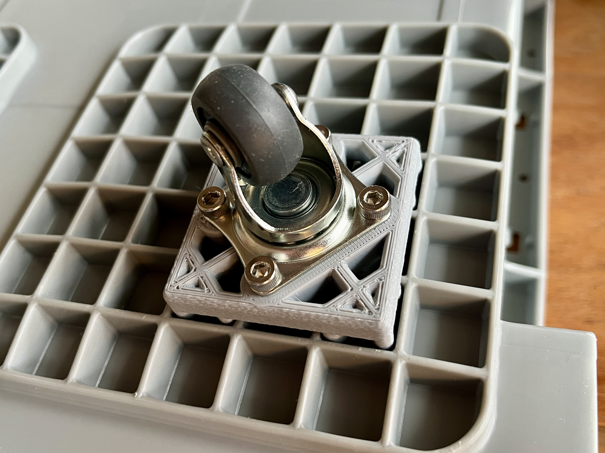

# fooTP

**fooTP** is minimal caster adapter for TP standard containers.

## What is TP standard?

[TP(Toyota poly box)](http://www.toyota-lf.com/product/hokan_detail/d_plasticcontainer.html) is a standard of plastic containers for logistics designed by TOYOTA.

## Parts list

| Name | size | pcs |
|:-----|:-----|:---:|
|fooTP body||1|
|Caster|φ25mm, 28x23mm holes, free|1|
|Screws|M4, 10mm|4|
|Hexagon nuts|M4|4|

## Build

That's it.

## 3D Printing

- It is recommended to print with PETG filament.
- It doesn't need any support materials.
- [Fuzzy skin](https://help.prusa3d.com/article/fuzzy-skin_246186) is useful to make it tight to attach.

## Leading manufacturers of TP containers

- [Sanko(三甲株式会社)](https://www.sanko-kk.co.jp/)
- [Risu(岐阜プラスチック工業株式会社)](https://www.risu.co.jp/)
- [Sekisui Techno Molding(積水テクノ成型株式会社)](https://sekisui-techno-molding.jp/)

## License

<a property="dct:title" rel="cc:attributionURL" href="https://github.com/takumiando/footp">fooTP</a> by Takumi Ando is licensed under <a href="http://creativecommons.org/licenses/by-nc-sa/4.0/?ref=chooser-v1" target="_blank" rel="license noopener noreferrer" style="display:inline-block;">CC BY-NC-SA 4.0</a>

